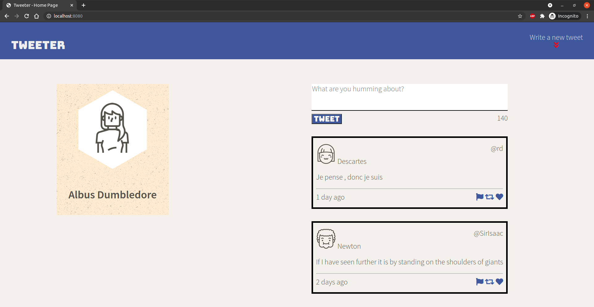

# Tweeter Project

Tweeter is a simple, single-page Twitter clone. It uses HTML, CSS, JS, jQuery and Ajax on the front-end, and Node, Express, and MongoDB on the back-end. The app uses an elegant responsive design that is sure to delight users with many tastes on any platform. The single page design also ensures that users will not have to endure load times between submitting their new tweets and viewing them.

## Features
  -Responsive design for a pleasent viewing experience on desktop or mobile.
  -Allows users to write their own tweets containing anything they want (up to 140 characters of course).
  -Updates tweets in real time without any page refreshes.
  -Displays all past tweets in reverse-chronological order.

## Screenshots

)
)

## Getting Started

1. Fork this repository, then clone your fork of this repository.
2. Install dependencies using the `npm install` command.
3. Start the web server using the `npm run local` command. The app will be served at <http://localhost:8080/>.
4. Go to <http://localhost:8080/> in your browser.

## Dependencies

- Express
- Node 5.10.x or above